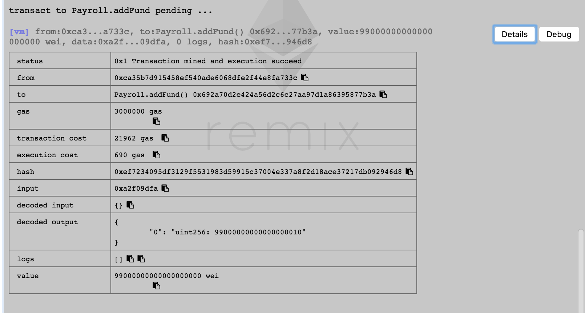
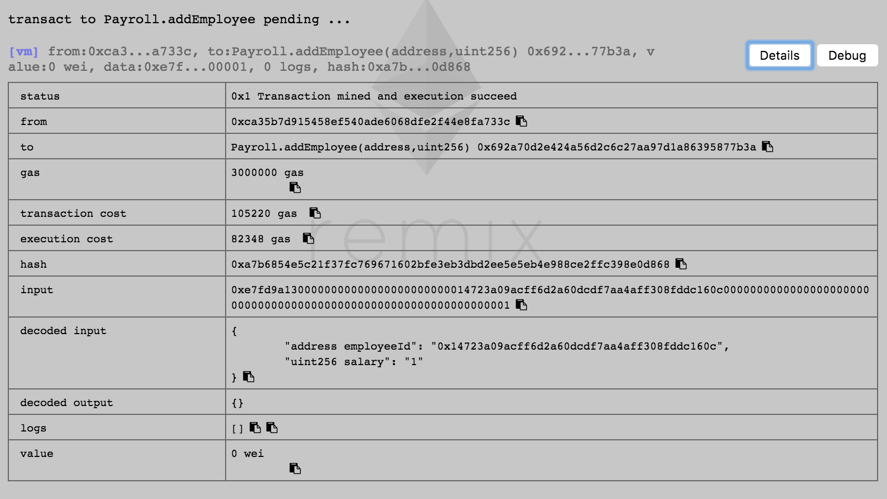
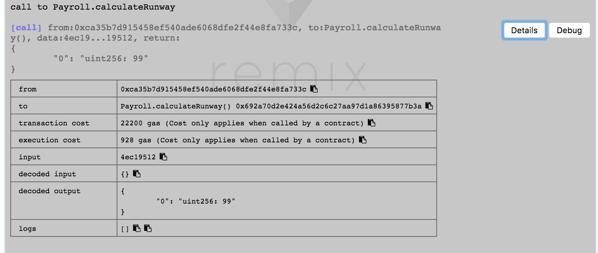
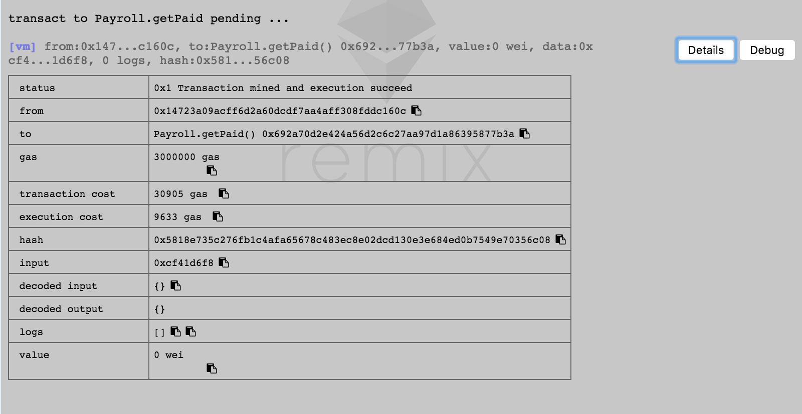
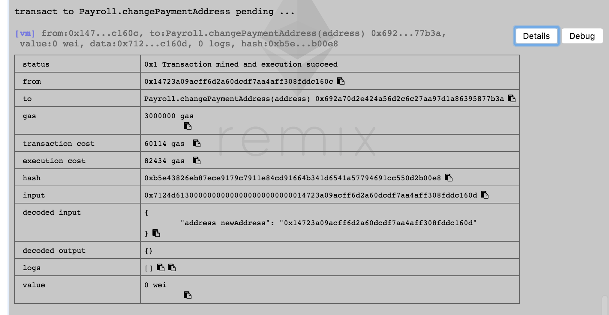
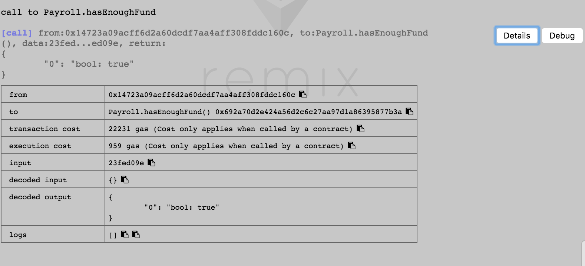
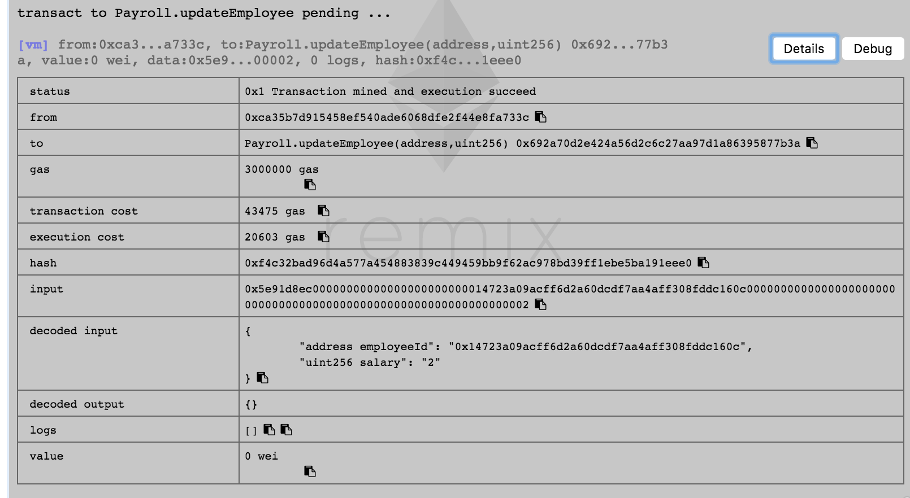
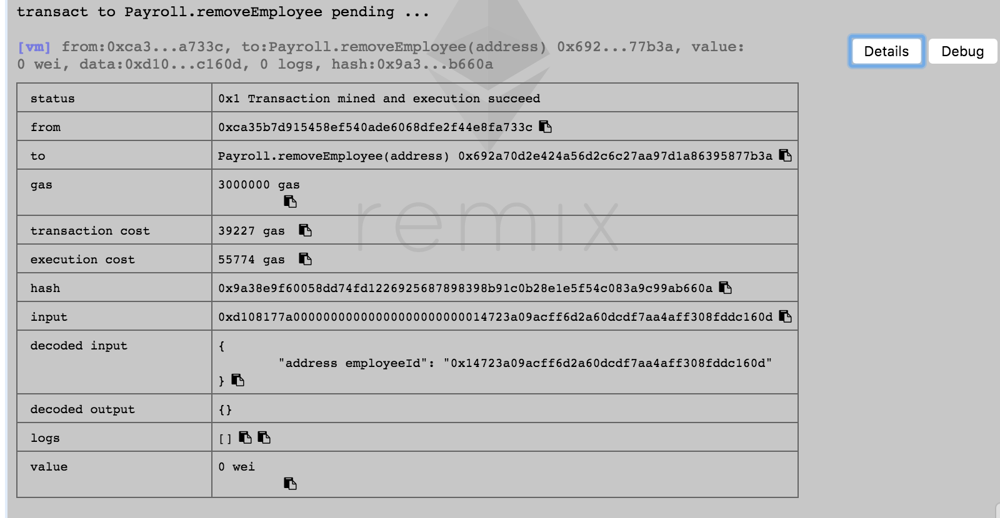

# 第三课

## Q1: 完成今天所开发的合约产品化内容，使用Remix调用每一个函数，提交函数调用截图

### `addFund`


### `addEmployee`


### `calculateRunway`


### `getPaid`


### `changePaymentAddress`


### `hasEnoughFund`


### `updateEmployee`


### `removeEmployee`


### `transferOnwership`


## Q2: 增加 changePaymentAddress 函数，更改员工的薪水支付地址，思考一下能否使用modifier整合某个功能

参考 `Payroll.sol`. 我用了 一个 `deleteEmployee` 的modifier在最后删除`map`里面一个固定的address。

## Q3: 自学C3 Linearization, 求以下 contract Z 的继承线

- contract O
- contract A is O
- contract B is O
- contract C is O
- contract K1 is A, B
- contract K2 is A, C
- contract Z is K1, K2

我参考了 [Wikipedia](https://en.wikipedia.org/wiki/C3_linearization).

Notice that `contract K1 is A, B` in **Solidity** means `class K1 extends B, A` in Python. Therefore the order of inheritance will reverse.

```
L(O) := [O]  
L(A) := [A] + merge(L(O), [O])
      = [A] + merge([O], [O])
      = [A, O]  
L(B) := [B, O]
L(C) := [C, O]
L(K1):= [K1] + merge(L(B), L(A), [B, A])   // 先B再A
      = [K1] + merge([B, O], [A, O], [B, A])
      = [K1, B] + merge([O], [A, O], [A])
      = [K1, B, A] + merge([O], [O])
      = [K1, B, A, O] 
L(K2):= [K2, C, A, O] 
L(Z) := [Z] + merge(L(K2), L(K1), [K2, K1])
      = [Z] + merge([K2, C, A, O], [K1, B, A, O], [K2, K1] )
      = [Z, K2] + merge([C, A, O], [K1, B, A, O], [K1] )
      = [Z, K2, C] + merge([A, O], [K1, B, A, O], [K1] )
      = [Z, K2, C, K1] + merge([A, O], [B, A, O] )
      = [Z, K2, C, K1, B] + merge([A, O], [A, O] )
      = [Z, K2, C, K1, B, A] + merge([O], [O] )
      = [Z, K2, C, K1, B, A, O]
```