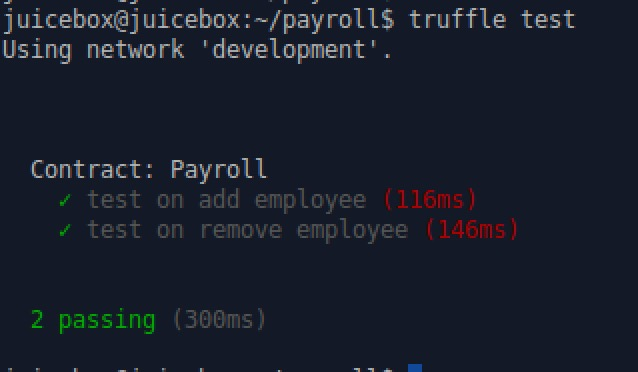

# 第四课

## 问题
- 将第三课完成的payroll.sol程序导入truffle工程
- 在test文件夹中，写出对如下两个函数的单元测试：
- function addEmployee(address employeeId, uint salary) onlyOwner
- function removeEmployee(address employeeId) onlyOwner employeeExist(employeeId)
- 思考一下我们如何能覆盖所有的测试路径，包括函数异常的捕捉

## 答案
这里我用JavaScript的方式来做test。具体的两个test function在 `test/Payroll.js`。别的内容就不放过来了。运行完毕后结果如下：

